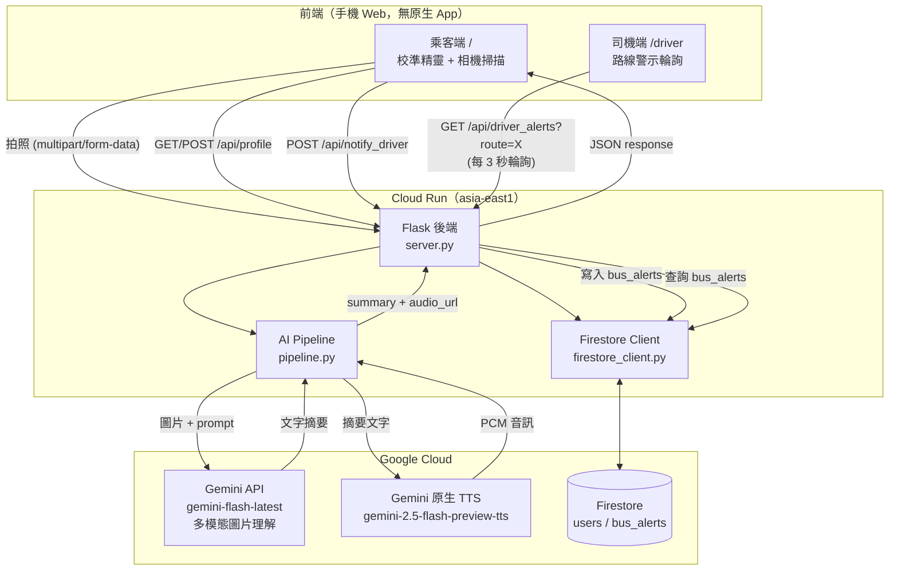

# 城市之眼 — 技術架構

視覺障礙族群（隧道視野、中心黑點、低視力、全盲）的公車資訊無障礙 Agent。掃描公車站牌 → Gemini 理解畫面 → 依個人校準結果客製化語音與畫面呈現 → 同步通知公車司機該站有視障乘客等車。

## 系統架構圖



## 核心資料流

### 1. 掃描辨識（乘客端）

```
使用者對準站牌 → 點螢幕任意處（tapLayer）
  → canvas 擷取當前 video frame → toBlob(jpeg)
  → POST /api/analyze (image, user_id)
  → pipeline.describe_image(): Gemini 多模態理解圖片，依 prompt 產出
    語音友善摘要（含方位詞、危險提示、控制在 3 句以內）
  → pipeline.synthesize_speech(): 同一支 Gemini 模型家族的原生 TTS，
    輸出 PCM，包裝成 WAV
  → 回傳 { summary, audio_url, route }
    route 由摘要文字用 regex 粗略擷取（\d{2,4}），供「通知司機」使用
  → 前端依個人校準結果（visible_radius_percent）將摘要文字切段、
    計算每段停留秒數，分段顯示在全螢幕結果頁並同步語音播放
```

### 2. 使用者校準（一次性，Firestore 記住）

```
首次造訪 → GET /api/profile?user_id=X → { exists: false }
  → 顯示校準精靈：
    Step 1 障礙類型（隧道視野／中心黑點／低視力／全盲）
    Step 2 可視範圍滑桿（即時相機預覽 + 圓形遮罩，模擬視野範圍）
    Step 3 字體大小滑桿（即時文字預覽）
    Step 4 色調（白底黑字／黑底白字）
  → POST /api/profile 存入 Firestore users/{user_id}
  → 之後每次造訪直接讀取，不再重複詢問
```

**個人化資訊節奏換算**（前端 `computePacing()`）：
可視範圍越小 → 每段顯示字數越少、停留時間越長，公式：

```
charsPerChunk   = max(8, round(0.6 * visible_radius_percent + 8))
secondsPerChunk = max(2, round(8 - visible_radius_percent / 15))
```

### 3. 通知司機（雙受眾協作）

```
掃描結果含 route → 顯示「通知司機」按鈕
  → POST /api/notify_driver { user_id, route }
  → 後端查 Firestore 拿該使用者 impairment_type
  → 寫入 bus_alerts collection { route, stop_name, impairment_type, created_at }

司機端 /driver 輸入路線號碼 → 每 3 秒 GET /api/driver_alerts?route=X
  → 後端用單一 equality 篩選查 bus_alerts（避免複合索引依賴），
    在 Python 端過濾 10 分鐘內的有效警示並排序
  → 前端渲染警示卡片
```

## GCP 服務使用一覽

| 服務 | 用途 | 備註 |
|---|---|---|
| **Gemini API**（`gemini-flash-latest`） | 多模態圖片理解，辨識站牌文字、方位、危險提示 | 以 API 金鑰驗證，非 Vertex AI |
| **Gemini 原生 TTS**（`gemini-2.5-flash-preview-tts`） | 文字轉語音，與圖片理解共用同一把金鑰 | 取代 Cloud Text-to-Speech（該服務不支援 API 金鑰驗證） |
| **Firestore**（Native mode，`asia-east1`） | `users`（使用者校準偏好）、`bus_alerts`（司機警示） | Cloud Run 上用內建服務身分存取，不需金鑰檔 |
| **Cloud Run**（`asia-east1`） | 承載 Flask 後端與前端頁面，提供公開 HTTPS 網址 | 相機權限（`getUserMedia`）需要 HTTPS，故必須部署而非僅本機測試 |
| **Cloud Build** | `gcloud run deploy --source .` 自動建置 Docker image | 使用專案內 `Dockerfile` |

## 技術棧

- **前端**：純 HTML/CSS/JavaScript（無框架），`localStorage` 存裝置 `user_id`（免登入系統）
- **後端**：Python 3.11 + Flask
- **AI**：Google GenAI SDK（`google-genai`），單一 API 金鑰同時呼叫圖片理解與語音生成
- **資料庫**：`google-cloud-firestore`
- **部署**：Docker + Cloud Run

## API 一覽

| Method | Path | 說明 |
|---|---|---|
| GET | `/` | 乘客端頁面 |
| GET | `/driver` | 司機端頁面 |
| GET | `/api/profile?user_id=X` | 讀取使用者校準偏好 |
| POST | `/api/profile` | 儲存使用者校準偏好 |
| POST | `/api/analyze` | 上傳照片，回傳語音摘要 + 音檔網址 + 辨識到的路線號碼 |
| POST | `/api/notify_driver` | 通知司機（寫入 Firestore） |
| GET | `/api/driver_alerts?route=X` | 司機端查詢該路線的有效警示 |
| GET | `/audio/<filename>` | 語音檔案（Cloud Run 執行期產生，非持久化） |

## 部署資訊

- GCP 專案：`devjam26aug17tpe-1280`（主辦方提供）
- Cloud Run 服務：`hackathon-smartcity`（asia-east1，允許未經驗證公開存取）
- 網址：`https://hackathon-smartcity-411737108721.asia-east1.run.app`
- 原始碼：`github.com/him6794/devjam`（分支 `smartcity-mvp`）

## 已知限制 / 未來規劃

- 語音檔存在 Cloud Run 容器本機磁碟，非持久化（容器重啟即消失），僅供單次播放，不影響 demo 但正式產品應改存 Cloud Storage
- `route` 擷取為簡易 regex，非結構化 JSON 輸出，複雜場景可能誤判
- 尚未接入 Vertex AI Agent Builder 的 function calling，目前是固定流程而非模型自主決策工具呼叫
- 尚未實作裝置端 WebGPU 即時周邊障礙物偵測（規劃中，作為低延遲即時警示層的延伸）
