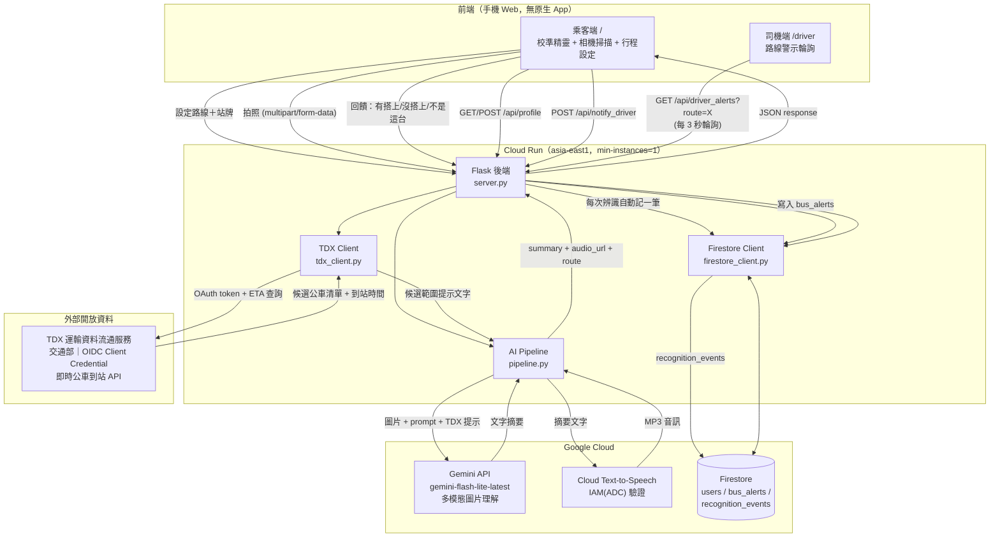

# 城市之眼 — 技術架構

視覺障礙族群（隧道視野、中心黑點、低視力、全盲）的公車資訊無障礙 Agent。掃描公車站牌 → 融合 TDX 即時到站資料縮小 AI 辨識候選範圍 → Gemini 理解畫面 → 依個人校準結果客製化語音與畫面呈現，同時把每次辨識回饋成城市無障礙感測資料。

**核心定位**：臺北好行讓公車知道視障者在哪裡；我們讓視障者知道公車在哪裡。

## 系統架構圖



## 四大模組

| 模組 | 名稱 | 核心問題 |
|---|---|---|
| 1 | Camera Perception | 「我現在看到什麼？」 |
| 2 | Personalized Accessibility | 「怎麼把答案給這個人？」 |
| 3 | City-Data Fusion（TDX） | 「城市知道哪些公車應該正在這裡」 |
| 4 | Accessibility Telemetry | 「這次使用能不能讓城市變得更好」 |

四個模組串成一條 chain：**看到 → 個人化輸出 → 用城市資料縮小候選範圍再確認 → 把這次經驗回饋給城市**。

## 核心資料流

### 模組 1+3：掃描辨識（城市資料融合）

```
使用者點左上角行程列 → 輸入路線（如 307）＋站牌（如 民生國中）
  → 存 localStorage，每 20 秒自動輪詢 GET /api/tdx_eta
  → tdx_client 用 Client Credential 換 access token（24hr 有效，記憶體快取）
  → 呼叫 TDX /Bus/EstimatedTimeOfArrival/City/Taipei/{route}
  → 依站名篩選、依到站時間排序，前端顯示「307 號預計 X 分鐘後到站」

使用者點螢幕任意處掃描 → canvas 擷取畫面（縮到最長邊 1024px，加快上傳/分析）
  → POST /api/analyze (image, user_id, route, stop_name)
  → 後端再查一次 TDX，組成提示句：
    「307 路公車預計約 X 分鐘後到達，請確認畫面中是否為 307 號，
      並留意可能同時出現的其他路線」
  → 這句提示連同圖片一起送進 Gemini —— 辨識問題從
    P(route | camera) 縮小成 P(route | camera, city_data)
  → TDX 若失敗（逾時/查無資料）不阻塞主流程，自動退回純視覺辨識
  → Gemini 回傳語音友善摘要 → Cloud Text-to-Speech 合成語音
  → 回傳 { summary, audio_url, route, tdx_eta_minutes, event_id }
  → 前端依可視範圍分段顯示文字＋語音播放（見模組 2）
```

**實測延遲**：原始版本（Gemini 原生 TTS）約 8 秒；改用 `gemini-flash-lite-latest` +
Cloud Text-to-Speech（IAM 驗證，非 API 金鑰）+ 圖片縮尺寸後，降到約 **2 秒**。

### 模組 2：使用者校準（一次性，Firestore 記住）

```
首次造訪 → GET /api/profile?user_id=X → { exists: false }
  → 校準精靈：障礙類型 → 可視範圍滑桿（相機即時預覽＋圓形遮罩）→
    字體大小 → 色調（白底黑字／黑底白字）
  → POST /api/profile 存入 Firestore users/{user_id}
  → 右上角「⚙ 調整視野／字體」按鈕可隨時重新打開精靈修改
```

**個人化資訊節奏換算**（前端 `computePacing()`）：可視範圍越小 → 每段顯示字數越少、停留時間越長：

```
charsPerChunk   = max(8, round(0.6 * visible_radius_percent + 8))
secondsPerChunk = max(2, round(8 - visible_radius_percent / 15))
```

結果頁改為全螢幕（依使用者色調），不再疊在相機畫面上，避免背景干擾對比度。

### 模組 4：城市無障礙感測回饋

```
每次 /api/analyze 執行完（不論成功失敗）
  → db.log_recognition_event()：寫入 recognition_events collection
    欄位：user_id, stop_name, route, success, duration_seconds,
          impairment_type, used_tdx_hint, feedback, feedback_note, created_at
  → 前端顯示「✅ 有搭上／❌ 沒搭上／🚫 不是這台」三個回饋按鈕
  → POST /api/feedback 補寫回饋欄位
  → GET /api/export.csv 匯出全部事件（demo 用；未來規劃：Dashboard + Open API）
```

**動機**：現行常用愛心卡刷卡數據當視障者搭車行為的 proxy，樣本 noise 高、
只覆蓋部分路線。這個模組讓每一次真實使用都變成一筆結構化資料，長期可回答
「哪些站點/時段對視障者最難搭車」，作為無障礙設施預算分配的參考。

### 通知司機（雙受眾協作）

```
掃描結果含 route → 顯示「通知司機」按鈕 → POST /api/notify_driver
  → 寫入 bus_alerts collection { route, stop_name, impairment_type, created_at }
司機端 /driver 輸入路線號碼 → 每 3 秒 GET /api/driver_alerts?route=X 輪詢顯示
```

## GCP／外部服務使用一覽

| 服務 | 用途 | 備註 |
|---|---|---|
| **Gemini API**（`gemini-flash-lite-latest`） | 多模態圖片理解，結合 TDX 提示縮小候選範圍 | API 金鑰驗證，非 Vertex AI；比一般 flash 快約 34% |
| **Cloud Text-to-Speech** | 文字轉語音 | IAM(ADC) 驗證，比 Gemini 原生 TTS 快約 3 倍（1.8s vs 5.5s） |
| **Firestore**（Native mode，`asia-east1`） | `users`／`bus_alerts`／`recognition_events` 三個 collection | Cloud Run 上用內建服務身分存取 |
| **Cloud Run**（`asia-east1`，min-instances=1） | 承載前後端，公開 HTTPS 網址 | 常駐 1 個實例避免冷啟動延遲；相機權限需要 HTTPS |
| **Cloud Build** | `gcloud run deploy --source .` 自動建置 | 使用專案內 `Dockerfile` |
| **TDX 運輸資料流通服務**（交通部開放資料，非 GCP） | 即時公車到站時間，餵給 Gemini 當候選範圍提示 | OIDC Client Credential 驗證，一般會員免費額度 |

## 技術棧

- **前端**：純 HTML/CSS/JavaScript（無框架），`localStorage` 存 `user_id` 與行程（路線/站牌）
- **後端**：Python 3.11 + Flask
- **AI**：Google GenAI SDK（圖片理解）+ Cloud Text-to-Speech（語音）
- **資料庫**：`google-cloud-firestore`
- **外部資料**：TDX OIDC Client Credential + REST API
- **部署**：Docker + Cloud Run

## API 一覽

| Method | Path | 說明 |
|---|---|---|
| GET | `/` | 乘客端頁面 |
| GET | `/driver` | 司機端頁面 |
| GET | `/api/profile?user_id=X` | 讀取使用者校準偏好 |
| POST | `/api/profile` | 儲存使用者校準偏好 |
| GET | `/api/tdx_eta?route=X&stop=Y` | 查詢 TDX 即時到站資料 |
| POST | `/api/analyze` | 上傳照片（可帶 route/stop_name）→ 語音摘要 + 音檔 + 路線 + event_id |
| POST | `/api/feedback` | 回報搭車結果（boarded / missed / not_this_one） |
| GET | `/api/export.csv` | 匯出全部辨識事件（模組 4 telemetry） |
| POST | `/api/notify_driver` | 通知司機（寫入 Firestore） |
| GET | `/api/driver_alerts?route=X` | 司機端查詢該路線的有效警示 |
| GET | `/audio/<filename>` | 語音檔案（Cloud Run 執行期產生，非持久化） |

## 部署資訊

- GCP 專案：`devjam26aug17tpe-1280`（主辦方提供）
- Cloud Run 服務：`hackathon-smartcity`（asia-east1，允許未經驗證公開存取，min-instances=1）
- 網址：`https://hackathon-smartcity-411737108721.asia-east1.run.app`
- 原始碼：`github.com/him6794/devjam`（分支 `smartcity-mvp`）

## 已知限制 / 未來規劃

- 語音檔存在 Cloud Run 容器本機磁碟，非持久化，僅供單次播放；正式產品應改存 Cloud Storage
- `route` 擷取為簡易 regex，非結構化 JSON 輸出，複雜場景可能誤判
- TDX 候選範圍目前用「單一路線 ETA 提示」實作；規格中「多台公車同時進站的左右相對位置比對」尚未做，列為進階版
- 尚未接入 Vertex AI Agent Builder 的 function calling，目前是固定流程而非模型自主決策工具呼叫
- 模組 4 目前輸出為 CSV，Dashboard 視覺化與 Open API 為未來規劃
- 尚未實作裝置端 WebGPU 即時周邊障礙物偵測（規劃中，作為低延遲即時警示層的延伸）
